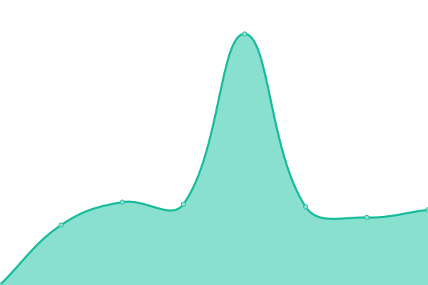

# [📈 Live Status](https://juanro22.github.io/uptime): <!--live status--> **🟧 Partial outage**

This repository contains the open-source uptime monitor and status page for [Juan R. Hernández](https://juanro22.github.io/uptime), powered by [Upptime](https://github.com/upptime/upptime).

With [Upptime](https://upptime.js.org), you can get your own unlimited and free uptime monitor and status page, powered entirely by a GitHub repository. We use [Issues](https://github.com/juanro22/uptime/issues) as incident reports, [Actions](https://github.com/juanro22/uptime/actions) as uptime monitors, and [Pages](https://juanro22.github.io/uptime) for the status page.

<!--start: status pages-->
<!-- This summary is generated by Upptime (https://github.com/upptime/upptime) -->
<!-- Do not edit this manually, your changes will be overwritten -->
<!-- prettier-ignore -->
| URL | Status | History | Response Time | Uptime |
| --- | ------ | ------- | ------------- | ------ |
|  [COG](http://cogpub.albanesi.com.ar:8080/COG) | 🟩 Up | [cog.yml](https://github.com/ITAlbanesi/uptime/commits/HEAD/history/cog.yml) | 

 2417ms
     
 | 

<a href="https://italbanesi.github.io/uptime/history/cog">98.83%</a>
    

|  [ENERGIA](http://cogpub.albanesi.com.ar:8080/EENEW) | 🟩 Up | [energia.yml](https://github.com/ITAlbanesi/uptime/commits/HEAD/history/energia.yml) | 

 1914ms
     
 | 

<a href="https://italbanesi.github.io/uptime/history/energia">98.85%</a>
    

|  [GAS](http://gas.albanesi.com.ar/login) | 🟥 Down | [gas.yml](https://github.com/ITAlbanesi/uptime/commits/HEAD/history/gas.yml) | 

 0ms
     
 | 

<a href="https://italbanesi.github.io/uptime/history/gas">100.00%</a>
    

<!--end: status pages-->

[**Visit our status website →**](https://juanro22.github.io/uptime)

## 📄 License

- Powered by: [Upptime](https://github.com/upptime/upptime)
- Code: [MIT](./LICENSE) © [Juan R. Hernández](https://juanro22.github.io/uptime)
- Data in the `./history` directory: [Open Database License](https://opendatacommons.org/licenses/odbl/1-0/)
