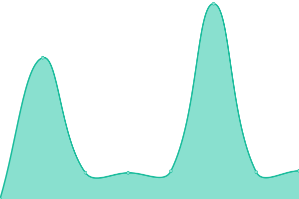

# [📈 Live Status](https://italbanesi.github.io/uptime): <!--live status--> **🟩 All systems operational**

This repository contains the open-source uptime monitor and status page for [Juan R. Hernández](https://italbanesi.github.io/uptime), powered by [Upptime](https://github.com/upptime/upptime).

With [Upptime](https://upptime.js.org), you can get your own unlimited and free uptime monitor and status page, powered entirely by a GitHub repository. We use [Issues](https://github.com/italbanesi/uptime/issues) as incident reports, [Actions](https://github.com/italbanesi/uptime/actions) as uptime monitors, and [Pages](https://italbanesi.github.io/uptime) for the status page.

<!--start: status pages-->
<!-- This summary is generated by Upptime (https://github.com/upptime/upptime) -->
<!-- Do not edit this manually, your changes will be overwritten -->
<!-- prettier-ignore -->
| URL | Status | History | Response Time | Uptime |
| --- | ------ | ------- | ------------- | ------ |
|  [COG (nuevo servidor)](https://app.albanesi.com.ar/COG) | 🟩 Up | [cog-nuevo-servidor.yml](https://github.com/ITAlbanesi/uptime/commits/HEAD/history/cog-nuevo-servidor.yml) | 

 2906ms
     
 | 

<a href="https://italbanesi.github.io/uptime/history/cog-nuevo-servidor">100.00%</a>
    

|  [ENERGIA](http://cogpub.albanesi.com.ar:8080/EENEW) | 🟩 Up | [energia.yml](https://github.com/ITAlbanesi/uptime/commits/HEAD/history/energia.yml) | 

 1482ms
     
 | 

<a href="https://italbanesi.github.io/uptime/history/energia">100.00%</a>
    

|  [API Cammesa / Conectividad local](http://cogpub.albanesi.com.ar:8080/PUBAPI/API/ws.asmx/ExecuteTask?ID=F9AC1E99-6961-48FD-960D-2D098FA1FD57&Desde=2021-07-01T00:00:00&Hasta=2022-06-01T00:00:00) | 🟩 Up | [api-cammesa-conectividad-local.yml](https://github.com/ITAlbanesi/uptime/commits/HEAD/history/api-cammesa-conectividad-local.yml) | 

 353ms
     
 | 

<a href="https://italbanesi.github.io/uptime/history/api-cammesa-conectividad-local">100.00%</a>
    

|  [API Cammesa / Origen de datos](https://api.cammesa.com/pub-svc/public/findDocumentosByNemoRango?fechadesde=2021-07-01T00:00:00&fechahasta=2021-07-01T00:00:00&nemo=PROGRAMACION_DIARIA) | 🟩 Up | [api-cammesa-origen-de-datos.yml](https://github.com/ITAlbanesi/uptime/commits/HEAD/history/api-cammesa-origen-de-datos.yml) | 

 759ms
     
 | 

<a href="https://italbanesi.github.io/uptime/history/api-cammesa-origen-de-datos">100.00%</a>
    

|  [Publicador SOTR](http://sotr.albanesi.com.ar/Desktop/DesktopLogin.aspx) | 🟩 Up | [publicador-sotr.yml](https://github.com/ITAlbanesi/uptime/commits/HEAD/history/publicador-sotr.yml) | 

 641ms
     
 | 

<a href="https://italbanesi.github.io/uptime/history/publicador-sotr">100.00%</a>
    

<!--end: status pages-->

[**Visit our status website →**](https://italbanesi.github.io/uptime)

## 📄 License

- Powered by: [Upptime](https://github.com/upptime/upptime)
- Code: [MIT](./LICENSE) © [Juan R. Hernández para Albanesi IT](https://italbanesi.github.io/uptime)
- Data in the `./history` directory: [Open Database License](https://opendatacommons.org/licenses/odbl/1-0/)
